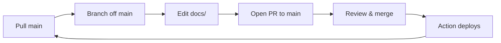

# Contributing

Quick guide for making changes to the Solana Thailand Genesis site. The short
version: **branch off `main`, open a PR, merge, the site auto-deploys.**

## Workflow



1. **Pull the latest `main`**
   ```sh
   git checkout main && git pull
   ```
2. **Branch off `main` directly** — use a descriptive name:
   ```sh
   git checkout -b feature/<short-description>
   # or: fix/<...>, docs/<...>, recap/<date-event>
   ```
3. **Edit files under `docs/`** — this is the only directory that's deployed.
4. **Verify locally** before pushing:
   ```sh
   cd docs && zola build && zola serve
   ```
5. **Push and open a PR targeting `main`:**
   ```sh
   git push -u origin feature/<short-description>
   gh pr create --base main
   ```
6. **Merge the PR** — the `Deploy Zola to GitHub Pages` action fires automatically
   on push to `main` and publishes to GitHub Pages within ~30s.

## Rules

- **PRs target `main` directly.** Do not stack PRs on top of other unmerged
  feature branches — stacked PRs merge "up" the chain and their changes never
  reach `main`, so they never deploy. (This bit us once already.)
- **One base, always `main`.** Even for follow-up work, rebranch off the latest
  `main` rather than chaining off an open PR.
- **Direct pushes to `main` are blocked** once branch protection is enabled
  (see below). Until then, treat it as a convention.
- **Delete your branch after merge.** Stale branches accumulate and cause
  confusion about what's deployed.

## Commit messages

Use [Conventional Commits](https://www.conventionalcommits.org/):

```
feat:     new feature or content
fix:      bug fix or broken link
docs:     documentation/content only
refactor: code restructure, no behavior change
recap:    post-event content updates
chore:    tooling, config, deps
```

Examples:
```
feat: add Road to Mainnet #3 event page
fix: replace broken Google Slides link in RTM#1
docs(recap): RTM#2 — close journey/roadmap drift, mark completed
```

## Branch protection (recommended)

To enforce the PR workflow above, enable branch protection on `main`:

> **GitHub repo → Settings → Branches → Add rule for `main`:**
> - ☑ Require a pull request before merging
> - ☑ Require approvals (≥1)
> - ☑ Require status checks to pass → add `build` (from `deploy-docs.yml`)
> - ☑ Require branches to be up to date before merging
> - ☑ Do not allow bypassing the above settings

This is what makes "we need to PR" a rule rather than a convention — without
it, direct pushes to `main` are still technically allowed.

## Deploy mechanism

- **Workflow:** `.github/workflows/deploy-docs.yml`
- **Triggers on:** push to `main` with changes under `docs/**`
- **Action:** `shalzz/zola-deploy-action` — builds `docs/` and force-pushes to
  the `gh-pages` branch, which GitHub Pages serves.
- **Live site:** https://solana-thailand.github.io/genesis/
- **No PR preview** — only `main` is deployed. Check your build locally with
  `zola serve` before merging.

## Tech stack

- **Static site generator:** [Zola](https://www.getzola.org) (install with
  `brew install zola`)
- **Templates:** Tera (`docs/templates/`)
- **Content:** Markdown with TOML frontmatter (`docs/content/`)
- **Styles:** Sass, compiled by Zola (`docs/sass/`)
- **No JS framework** — vanilla JS snippets inline in templates where needed
  (e.g. external link `target="_blank"` enforcement in event content).
